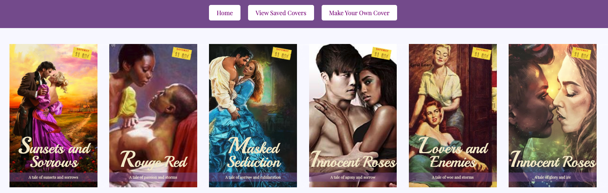

# Contents
1. [Introduction - RomCom or RomBookCover?](https://github.com/e-spitz/romcom#romcom-or-rombookcover)
2. [Navigating the Website](https://github.com/e-spitz/romcom#then-menu-buttons-are-at-the-top-of-the-screen)
3. [Make Your Own Cover](https://github.com/e-spitz/romcom#feeling-creative-make-your-own-cover)
4. [Show New Random Cover](https://github.com/e-spitz/romcom#need-ideas-to-get-your-creative-juices-flowing)
5. [Save Your Cover](https://github.com/e-spitz/romcom#love-what-you-see-want-to-save-it)
6. [View Saved Covers](https://github.com/e-spitz/romcom#check-out-your-favorites)
7. [Future Feature Additions](https://github.com/e-spitz/romcom#future-feature-additions)
8. [Technologies Used](https://github.com/e-spitz/romcom#technologies-used)
9. [Contributors](https://github.com/e-spitz/romcom#contributors)

## RomCom or RomBookCover?
Romantic comedies or romance novel covers... which is funnier? We couldn't decide either! There is just something about romance novel covers that is so inviting and so entertaining. Maybe it's the steamy image of two love birds embracing... or maybe it's the exciting descriptions that go along with the dramatic titles! There are just too many elements to enjoy. So we've decided to create a romance book cover generator! So all of your creative, romantic dreams of fire, ardor, zeal, and passion can come true!

Enjoy!

_Erica and Jani_

---

### [Get Started as a RomCom Book Cover Designer!](https://e-spitz.github.io/romcom/)

---

#### Then menu buttons are at the top of the screen.

   

1. Click on [Show New Random Cover](https://github.com/e-spitz/romcom#need-ideas-to-get-your-creative-juices-flowing) to see a selection of our inventory of book covers.
2. If you find a cover you like, click on [**Save Cover**](https://github.com/e-spitz/romcom/blob/main/README.md#love-what-you-see-want-to-save-it).
3. Don't like what you see? Or are you feeling creative? Follow the [**Make Your Own Cover**](https://github.com/e-spitz/romcom/blob/readme/first-draft-edits/README.md#feeling-creative-make-your-own-cover) steps below.
3. Save as many covers as you'd like. When you're ready to review your saved covers, click on [**View Saved Covers**](https://github.com/e-spitz/romcom/blob/main/README.md#check-out-your-favorites).

## Feeling Creative? Make Your Own Cover!

#### Click on the [**Make Your Own Cover**](https://github.com/e-spitz/romcom/blob/readme/first-draft-edits/README.md#feeling-creative-make-your-own-cover) button

There you will find a form to fill out and create your own book cover!
1. Simply enter a cover image URL, followed by your saucy title name, and two words to best describe your tale.
2. Then click the **Make my book** button to preview your custom cover!

    

## Need Ideas to Get Your Creative Juices Flowing?
1. Everytime you refresh the page, a brand new random cover will display!
   - You can sift through tons of pre-loaded covers full of love, devotion, and enchantment! _*OH MY*_!
3. See any you really love? Click the [**Save Cover**](https://github.com/e-spitz/romcom/blob/main/README.md#love-what-you-see-want-to-save-it) button.
4. What to review your saved covers? Click on the [**View Saved Covers**](https://github.com/e-spitz/romcom/blob/main/README.md#check-out-your-favorites) button.

## _LOVE_ What You See? Want to Save It?

#### The **Save Cover** button will save your favorites!
1. This allows you to save any cover you'd like! Whether it's one of our covers, or one you [custom created](https://github.com/e-spitz/romcom/blob/readme/first-draft-edits/README.md#feeling-creative-make-your-own-cover)!
2. Check out your whole collection of saved covers by click on the the [**View Saved Covers**](https://github.com/e-spitz/romcom/blob/main/README.md#check-out-your-favorites) button.

## Check out Your Favorites!

#### Click on the **View Saved Covers** button to take a look at your favorites!

   

---

### Future Feature Additions
We will continue to work towards adding more functionality including:
   - The ability to remove covers
   - A pop up error when an incomplete cover is submitted
   - Ability to drag and rearrange covers on the saved covers page
   - Mobile friendly capability
   - The ability to write your own title and tagline and select from an array of cover images

But in the meantime, get to *ROMCOM'N*!

### Technologies Used
User preferred computer browser.
Website built using HTML, CSS, and JavaScript.

### Contributors
  - HTML, CSS, and assets provided by instructors at [Turing School of Software & Design](https://turing.io/).
  - JavaScript written by Jani Palomino & Erica Spitz, two Frontend Engineering students.
