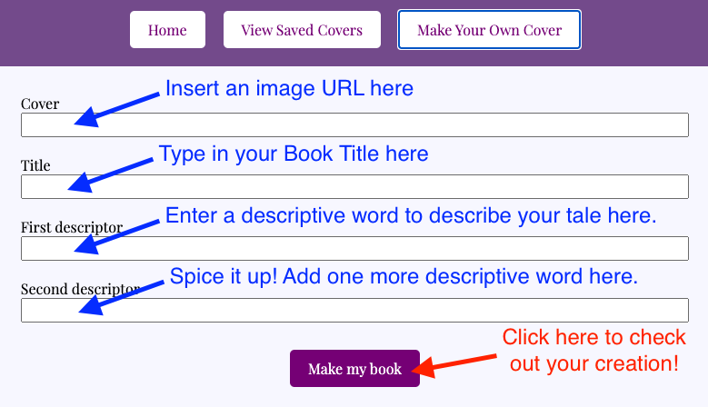

# Contents
1. Introduction
2. How to

## Introduction: RomCom or RomCover?
Romantic comedies or romance novel covers... which is funnier? We couldn't decide either! There is just something about romance novel covers that is so inviting and so entertaining. Maybe it's the steamy image of two love birds embracing... or maybe it's the exciting descriptions that go along with the dramatic titles! There are just too many elements to enjoy. So we've decided to create a romance book cover generator! So all of your creative, romantic dreams of fire, ardor, zeal, and passion can come true! 

Enjoy!

_Erica and Jani_

---

## How to explore RomCom?

### Start by visiting our [RomCom Designer](https://e-spitz.github.io/romcom/) website.

## Explore Book Covers

### Your menu buttons are at the top of the screen.

   

1. Click on **Show New Random Cover** to see a selection of our inventory of book covers.
2. If you find a cover you like, click on **Save Cover**.
3. Don't like what you see? Or are you feeling creative? Follow the **Make Your Own Cover** steps below.
3. Save as many covers as you'd like. When you're ready to review your saved covers, click on **View Saved Covers**.
    

## Feeling Creative? Make Your Own Cover!

1. Click on the **Make Your Own Cover** button
2. There you will find a form to fill out and create your own book cover!
3. Simply enter a cover image URL, followed by your saucy title name, and two words to best describe your tale.

    
    
## Need Ideas to Get Your Creative Juices Flowing?
1. Everytime you refresh the page, a brand new random cover will display!
   - A new spicy photo, book title, and clever taglines to keep you laughing, _*OH MY*_!
3. See any you really love? Click the **Save Cover** button.
4. What to review your saved covers? Click on the **View Saved Covers** button.

## Show New Random Cover Button
1. Like your current title and taglines but interested in exploring a different cover image? Click this button!
2. When clicked, you can sift through tons of pre-loaded images full of love, devotion, and enchantment!

## Save Cover Button
1. *LOVE* what you see and what to save it? Click this button!
2. This allows you to create any cover you'd like, whether its by the _Random Cover_ generator, refreshing the page, or the *Make Your Own Cover* form.
3. Refer to *Make Your Own Cover* button info below.

## View Saved Covers Button
1. When clicked, this button takes you to your favorite saved covers!
2. They should be displayed in rows and columns, allowing you to save as many as you'd like!
3. They are also displayed in cute little mini-cover poster styles, so they don't take up your entire screen!
4. *_NOTE_* We have a bug here. If you transfer back and forth from _Saved Covers_ to _Home_ it will keep adding the same covers. It also adds duplicate covers if you accidentally click the _Save Cover_ button twice for the same cover. We are working on this! Thanks for your patience!

## Make Your Own Cover Button
1. When clicked, this button takes you to a form where you can personalize your cover!
2. Line 1 allows you to input an image url, so you can choose _any_ smoldering cover photo you can find on the internet!
3. Line 2 of the form allows you to create your very own title. No limits on imagination!
4. Lines 3 & 4 allows you to change the descriptive words in the tagline! The more dramatic, the better!
5. When all lines are filled,  you can click the *Make My Cover* button to see your cover displayed on the home page!
6. Are you absolutely head over heels with this creation? _SAVE IT!_ with the _Save Cover_ button!

## Conclusion
Currently, this is all of the functionality we have for our website. We will continue to work towards adding more functionality like deleting covers or removing duplicates from the saved cover portion. But in the meantime, get to *ROMCOM'N*!

### Maintainers
1. Jani Palomino
2. Erica Spitz
